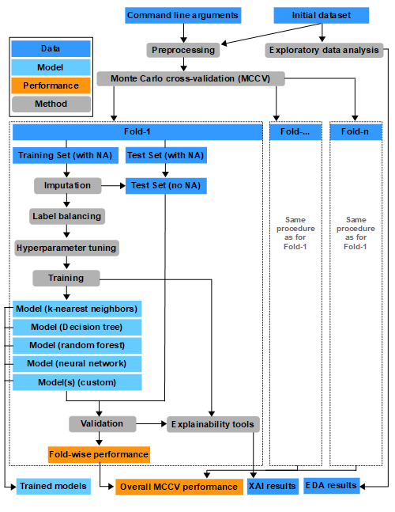

# TabularClassificationTemplate

This project aims to create a template for solving classification problems using Scikit-Learn for
tabular data.
The template shall handle binary as well as multi-class classification problems and shall include
a preprocessing pipeline. Further, the template shall be easily adaptable and extendible for an
easy integration into larger machine learning workflows.

Content:

- Preprocessing pipeline
    - Removing all-NA instances
    - Removing features with constant value over all instances (ignoring NaNs)
    - Removing features with too many missing values
    - Removing correlated features
- Fold-wise preprocessing pipeline
    - Normalization (standardization per default)
    - Filling missing values using kNN imputation
    - Resampling for handling label imbalances
- Performance estimation using Monte Carlo cross validation with multiple metrics
    - Accuracy
    - AUC
    - Sensitivity / Recall
    - Specificity
- Feature selection
- Hyperparameter optimization
- Training and evaluation of multiple classification algorithms
    - k-nearest neighbors
    - Decision tree
    - Random forest
    - Neural network
- Visualization of performance evaluation
    - Barplot with performances for the classification models

