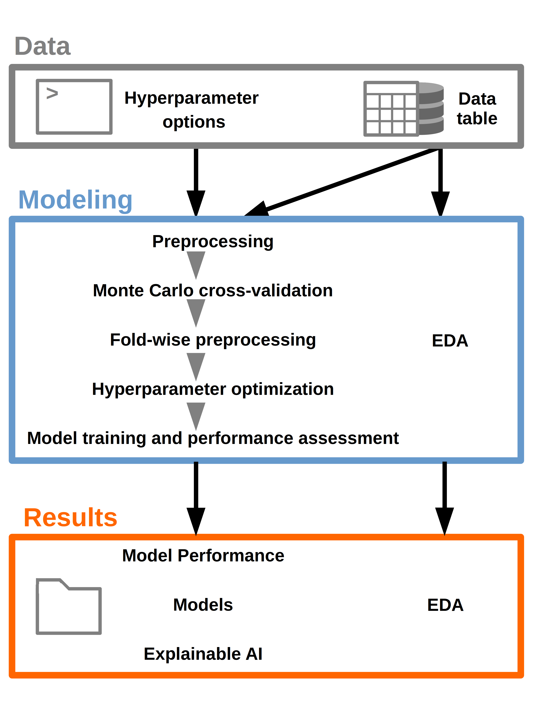

# TabularClassificationTemplate

## Summary
This project aims to create a template for solving classification problems for tabular data.
The template handles *binary and multi-class* problems. Among others, the project includes an *exploratory data analysis*, a *preprocessing* pipeline before train/test splitting, a fold-wise preprocessing pipeline after train/test splitting, a scalable and robust *Monte Carlo cross-validation scheme*, *six classification algorithms* which are evaluated for *four performance metrics* and set set of capabilities enabling *explainable artificial intelligence* including visualizations.



Content:

- Exploratory data analysis via Pandas Profiling
- Preprocessing
    - Removing all-NA instances
    - Removing features with constant value over all instances (ignoring NaNs)
    - Removing features with too many missing values
- Fold-wise preprocessing
    - Normalization
    - Filling missing values using kNN imputation
    - Resampling for handling label imbalances via SMOTE
- Performance estimation using Monte Carlo cross validation with multiple metrics
    - Accuracy
    - AUC
    - Sensitivity / Recall
    - Specificity
- Feature selection using mRMR
- Hyperparameter optimization (Using random grid search)
- Training and evaluation of multiple classification algorithms
    - Explainable Boosting Machine
    - XGBoost
    - k-nearest Neighbors
    - Decision Tree
    - Random Forest
    - Neural Network
- Explainable Artificial Intelligence (XAI)
    - Permutation feature importance (+ visualizations)
    - Partial dependence plots
    - SHAP values (+ summary visualization)
- Visualization of performance evaluation
    - Performances for each classification model via barplot
    - Confusion matrices

## Output
    - EDA: results as `html` report
    - Intermediate data: preprocessed data for final models as `csv`
    - Models: `pickle` objects and tuned hyperparameters as `json`
    - Performance: Confusion matrices and overall performance metrics for each model as `csv` and visalization as `png`
    - XAI: Partial dependence plots, permutation feature importances and SHAP summary plots as `csv` and `png`
    
    The output follows the following structure:
    
    ```
    Results/
        ├── EDA
        |   ├── exploratory_data_analysis.html
        |   └── umap.html
        ├── Intermediate_Data
        |   ├── preprocessed_features.csv
        |   └── preprocessed_labels.csv
        ├── Models
        |   ├── ebm_model.pickle
        |   ├── ebm_model_hyperparameters.json
        |   └── ... (other pickled models and hyperparameters)
        ├── Performance
        |   ├── confusion_matrix-ebm.csv
        |   ├── confusion_matrix-ebm.png
        |   ├── ... (other models confusion matrices)
        |   ├── performance.png
        |   └── performances.csv
        └── XAI
            ├── partial_dependence-ebm_feature-1_class-A.png
            ├── ... (PDPs of other features, models and classes)
            ├── Permutation_importance_ebm-test.png
            ├── Permutation_importance_ebm-train.png
            ├── ... (other models permutation importances for train and test set)
            ├── shap.csv
            ├── shap_summary-ebm.png
            └── ... (other models shap summary plots)
    ```

## Installation
